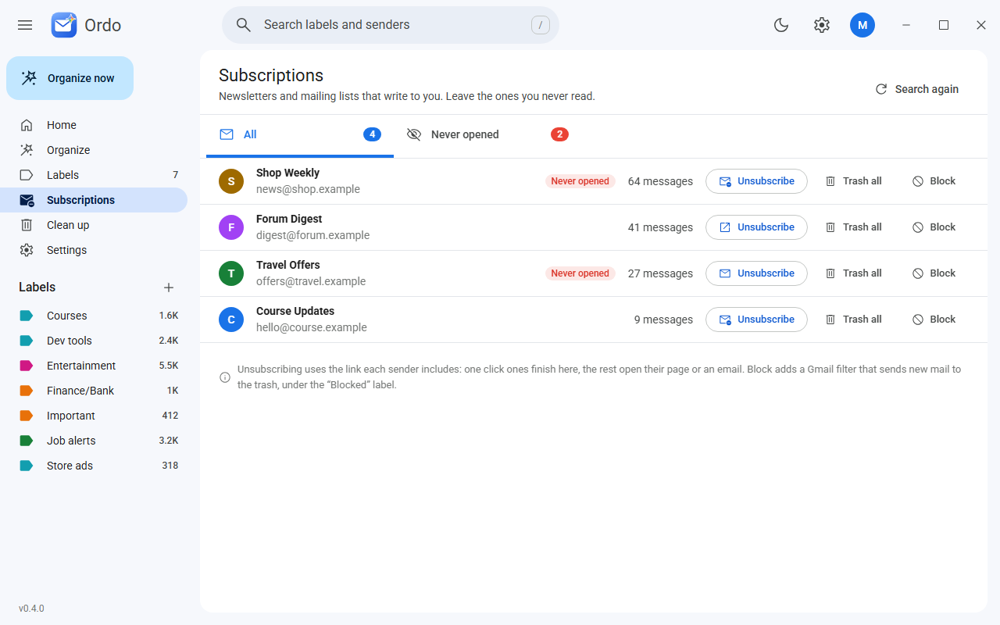
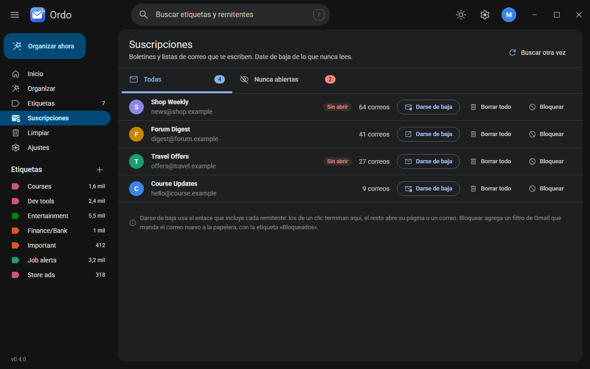

<p align="center"></p>

<h1 align="center">Ordo</h1>

<p align="center">Your inbox, in order. AI sorts your Gmail into labels and filters that keep working even with your computer off.</p>

<p align="center"></p>

## What it does

- **Organize with AI**: reads who writes to you (name, sender and subject only) and proposes the most specific label for each sender: one per company, client or project, invoices, services, banks, and generic buckets only for bulk mail.
- **Your choice of AI**: Claude Code with your subscription, the Claude API, Groq, Ollama running 100% on your computer, or any OpenAI compatible service.
- **Reorganize everything**: includes mail that already has a label and moves each sender out of generic buckets into a label of its own (its filter and its old messages move too).
- **You decide**: remove senders, rename labels and choose what happens to new mail: label, archive or trash.
- **Subscriptions**: finds the newsletters that write to you, shows the ones you never open and lets you unsubscribe, trash all their mail or block them.
- **Labels like the Gmail inbox**: counts, senders, quick actions on hover, rename, add a sender by hand, protect, empty or delete.
- **Clean up in one click**: spam, promotions, social or whole labels to the trash, filtered by age.
- **Feels like Gmail**: search with <kbd>/</kbd>, your labels in the sidebar, Google colors and icons, light and dark mode, English and Spanish.
- **Updates itself**: new releases install with one click.

Rules are Gmail filters, so they run on Google's servers 24/7 (phone included) => Ordo only needs to be open when you want to change something.

| Light | Dark, in Spanish |
|---|---|
|  |  |
|  |  |
|  |  |

## Safe by design

- **Nothing is deleted for good**: everything goes to the Gmail trash (30 days to recover) and protected labels are never touched.
- **Your keys stay on your computer**: the Google permission and your AI keys live in the system keychain, `credentials.json` in the app folder.
- **The AI sees little and can do nothing**: it only proposes; every answer is validated and you approve it before anything changes. Pick Ollama and nothing leaves your computer.

Details in [SECURITY.md](SECURITY.md).

## Download

Get `ordo-<version>.exe` from [Releases](https://github.com/DiegoFernandoLojanTenesaca/ordo-mail/releases/latest) and run it. Later versions arrive through the update button.

## Requirements

- Windows 10 or 11.
- A Gmail account and its `credentials.json` (one time setup, below).
- One AI engine, chosen in Settings:

| Engine | What you need | Your mail data |
|---|---|---|
| Claude Code (default) | [Claude Code](https://claude.com/code) installed and signed in | Sent to Anthropic |
| Claude API | A key from the [Claude Console](https://console.anthropic.com/settings/keys) | Sent to Anthropic |
| Groq | A key from [Groq](https://console.groq.com/keys), free tier included | Sent to Groq |
| Ollama | [Ollama](https://ollama.com/download) running and a model pulled, for example `ollama pull qwen3` | Stays on your computer |
| OpenAI compatible | Its address, and a key if it asks for one | Sent to that service |

## First run

1. Open [Google Cloud](https://console.cloud.google.com/) with the account you want to organize and create a project.
2. **APIs and services** => **Library** => **Gmail API** => **Enable**.
3. **Google Auth Platform** => **Get started**: app name, your email, audience **External**.
4. **Audience** => **Test users** => add your Gmail (keep the app in testing mode).
5. **Clients** => **Create client** => **Desktop app** => **Download JSON**.
6. Open Ordo, load that file on the welcome screen and connect your account.

In testing mode Google expires the permission every 7 days: Ordo asks you to connect again with one click. Revoke access anytime at [Google permissions](https://myaccount.google.com/permissions).

## Architecture

```
engine/                Rust: all the logic (Gmail, OAuth, AI engines, rules, subscriptions, clean up)
app/src-tauri/         Tauri commands: thin wrappers around the engine, plus the updater
app/src/lib/           Svelte UI: theme tokens, components, api, store, i18n
app/src/lib/locales/   UI text, one folder per language
app/src/lib/bindings/  TypeScript types generated from the engine
app/src/routes/        Home, Organize, Labels, Subscriptions, Clean up, Settings
scripts/               Release helpers
```

## Development

```bash
cd app
pnpm install
pnpm tauri dev                          # desktop app with live reload
pnpm dev                                # UI only in the browser, with sample data
pnpm check                              # Svelte and TypeScript
pnpm tauri build                        # installer in target/release/bundle/nsis (needs TAURI_SIGNING_PRIVATE_KEY)

cargo test -p engine                    # engine tests (also regenerates the TypeScript types)
cargo test -p engine -- --ignored       # live checks: Claude Code and a read only pass over your real mailbox
```

Adding a language is data only: copy `app/src/lib/locales/en` to a new folder and translate it.

## License

[MIT](LICENSE)