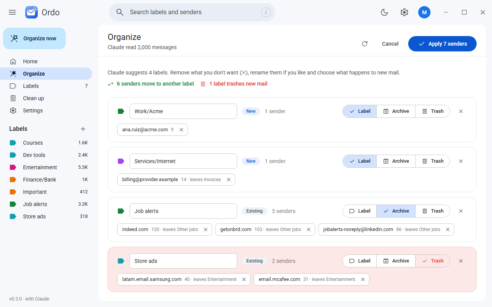
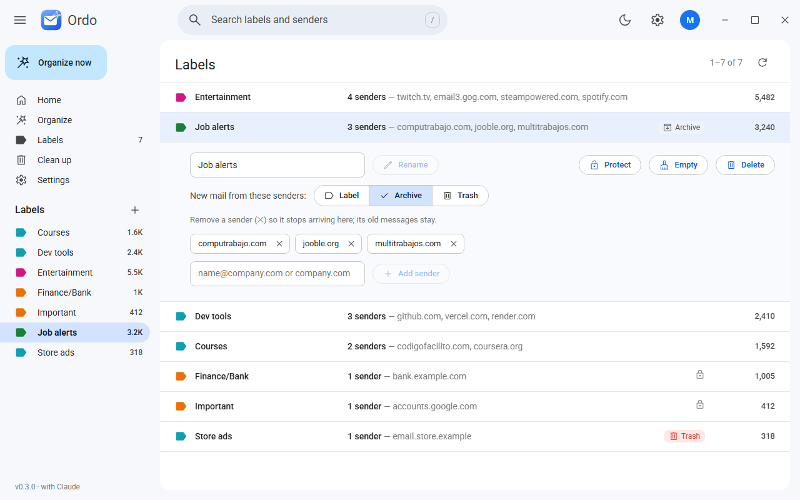
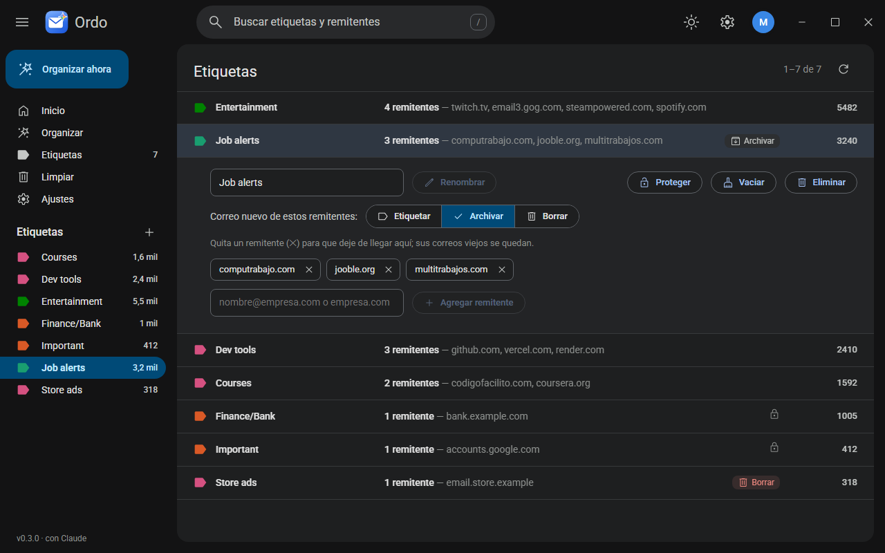
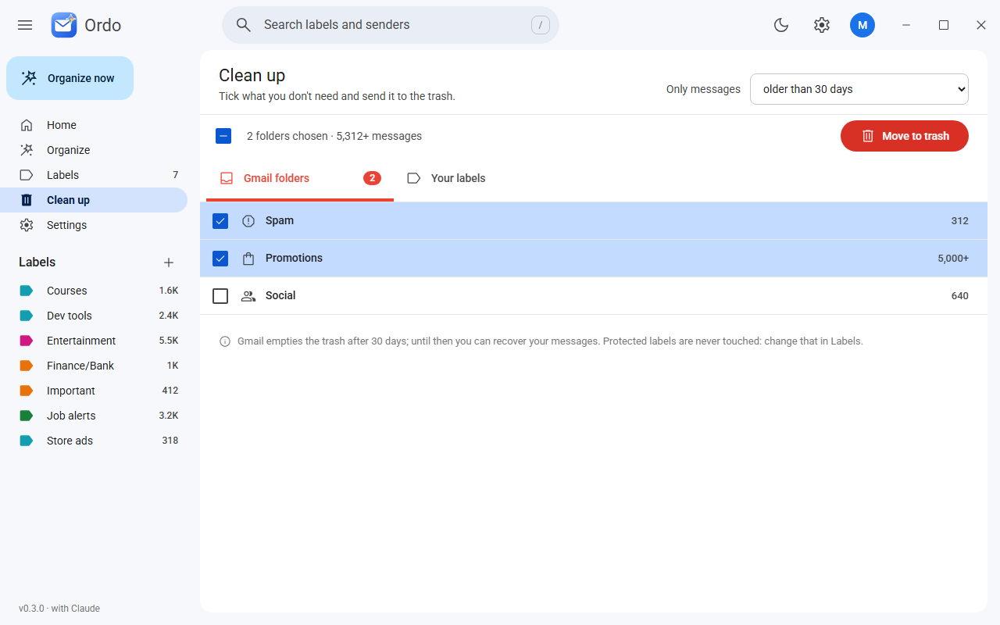
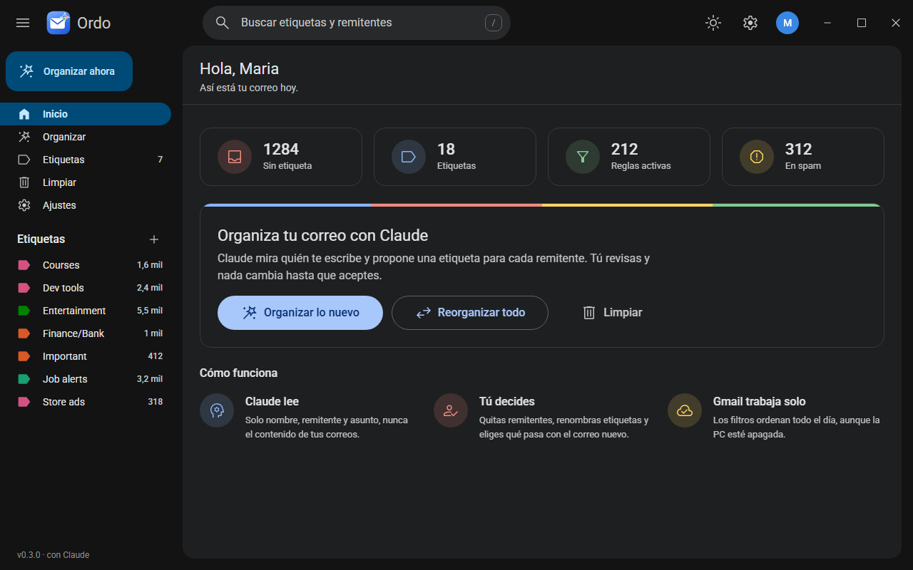

<p align="center"></p>

<h1 align="center">Ordo</h1>

<p align="center">Your inbox, in order. Claude sorts your Gmail into labels and filters that keep working even with your computer off.</p>

<p align="center"></p>

## What it does

- **Organize with Claude**: reads who writes to you (name, sender and subject only) and proposes the most specific label for each sender: one per company, client or project, invoices, services, banks, and generic buckets only for bulk mail.
- **Reorganize everything**: includes mail that already has a label and moves each sender out of generic buckets into a label of its own (its filter and its old messages move too).
- **You decide**: remove senders, rename labels and choose what happens to new mail: label, archive or trash.
- **Labels like the Gmail inbox**: counts, senders, quick actions on hover, rename, add a sender by hand, protect, empty or delete.
- **Clean up in one click**: spam, promotions, social or whole labels to the trash, filtered by age.
- **Feels like Gmail**: search with <kbd>/</kbd>, your labels in the sidebar, Google colors and icons, light and dark mode, English and Spanish.

Rules are Gmail filters, so they run on Google's servers 24/7 (phone included) => Ordo only needs to be open when you want to change something.

| Light | Dark, in Spanish |
|---|---|
|  |  |
|  |  |

## Safe by design

- **Nothing is deleted for good**: everything goes to the Gmail trash (30 days to recover) and protected labels are never touched.
- **Your keys stay on your computer**: the Google permission lives in the system keychain and `credentials.json` in the app folder.
- **Claude sees little and can do nothing**: it runs without tools and only proposes; every answer is validated and you approve it before anything changes.

Details in [SECURITY.md](SECURITY.md).

## Requirements

- Windows 10 or 11.
- [Claude Code](https://claude.com/code) installed and signed in (Ordo uses your subscription).
- A Gmail account and its `credentials.json` (one time setup, below).

## First run

1. Open [Google Cloud](https://console.cloud.google.com/) with the account you want to organize and create a project.
2. **APIs and services** => **Library** => **Gmail API** => **Enable**.
3. **Google Auth Platform** => **Get started**: app name, your email, audience **External**.
4. **Audience** => **Test users** => add your Gmail (keep the app in testing mode).
5. **Clients** => **Create client** => **Desktop app** => **Download JSON**.
6. Open Ordo, load that file on the welcome screen and connect your account.

In testing mode Google expires the permission every 7 days: Ordo asks you to connect again with one click. Revoke access anytime at [Google permissions](https://myaccount.google.com/permissions).

## Architecture

```
engine/                Rust: all the logic (Gmail, OAuth, Claude, rules, clean up)
app/src-tauri/         Tauri commands: thin wrappers around the engine
app/src/lib/           Svelte UI: theme tokens, components, api, store, i18n
app/src/lib/locales/   UI text, one folder per language
app/src/lib/bindings/  TypeScript types generated from the engine
app/src/routes/        Home, Organize, Labels, Clean up, Settings
```

## Development

```bash
cd app
pnpm install
pnpm tauri dev                          # desktop app with live reload
pnpm dev                                # UI only in the browser, with sample data
pnpm check                              # Svelte and TypeScript
pnpm tauri build                        # installer in target/release/bundle/nsis

cargo test -p engine                    # engine tests (also regenerates the TypeScript types)
cargo test -p engine -- --ignored       # live checks: Claude and a read only pass over your real mailbox
```

Adding a language is data only: copy `app/src/lib/locales/en` to a new folder and translate it.

## License

[MIT](LICENSE)